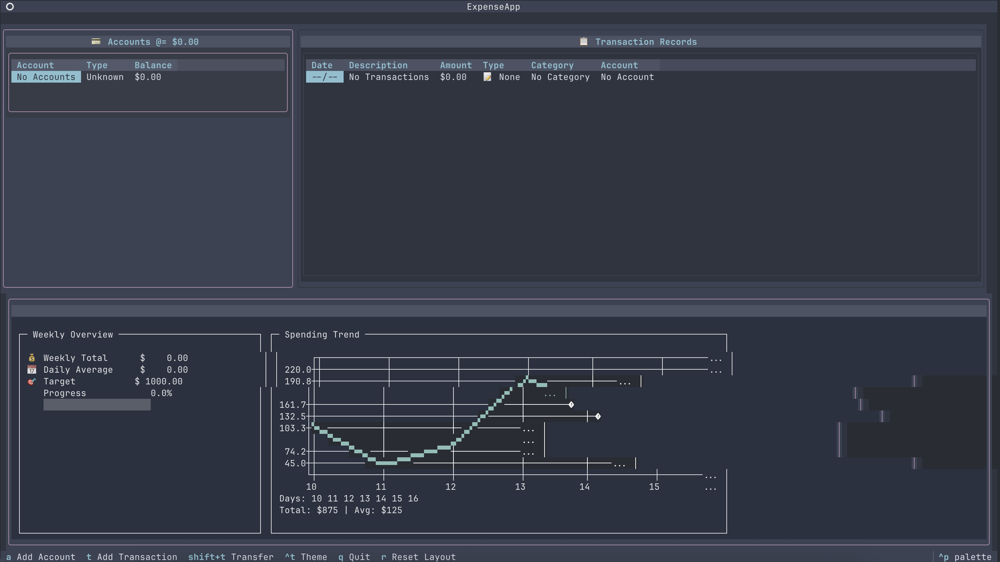

# 💰 Budgt.sh

A modern Terminal User Interface (TUI) application for tracking personal expenses and budgeting, built with Python and Textual.



## ✨ Features

- 📊 **Intuitive TUI Interface** - Modern, responsive terminal-based UI
- 💳 **Account Management** - Multiple account types (Cash, Bank, Credit Card, Savings)
- 📝 **Transaction Tracking** - Income, Expenses, and Transfers between accounts
- 🏷️ **Category Management** - Organized expense categories with visual indicators
- 📈 **Financial Insights** - Weekly summaries, daily trends, and category breakdowns
- 🎨 **Multiple Themes** - Switch between different color schemes
- 💾 **Local Storage** - SQLite database for secure, offline data storage

## 🚀 Installation

### Option 1: UV (Recommended - Fastest)
[UV](https://github.com/astral-sh/uv) is the fastest Python package installer and resolver.

```bash
# Install UV if you haven't already
curl -LsSf https://astral.sh/uv/install.sh | sh

# Install Budgt.sh
uv pip install budgt-sh

# Run the application
budgt
```

### Option 2: Homebrew (macOS/Linux)
```bash
# Add the tap (once available)
brew tap yourusername/budgt-sh

# Install
brew install budgt-sh

# Run the application  
budgt
```

### Option 3: pipx (Isolated Installation)
```bash
# Install pipx if you haven't already
python -m pip install --user pipx
python -m pipx ensurepath

# Install Budgt.sh in isolated environment
pipx install budgt-sh

# Run the application
budgt
```

### Option 4: pip (Standard)
```bash
# Install from PyPI
pip install budgt-sh

# Run the application
budgt
```

### Option 5: From Source
```bash
# Clone the repository
git clone https://github.com/yourusername/budgt.sh.git
cd budgt.sh

# Install with UV (recommended)
uv pip install -e .

# Or install with pip
pip install -e .

# Run the application
budgt
```

### Prerequisites
- Python 3.8 or higher
- Terminal with color support (most modern terminals)

## 🎮 Usage

### Keyboard Shortcuts
- `a` - Add new account
- `t` - Add new transaction
- `Shift+T` - Transfer money between accounts
- `Ctrl+T` - Toggle theme
- `Left/Right` - Expand account/transaction panels
- `r` - Reset layout to default
- `q` - Quit application

### Getting Started
1. **Create accounts** first using `a` - add your bank accounts, credit cards, etc.
2. **Add transactions** with `t` - record income and expenses
3. **Transfer money** between accounts with `Shift+T`
4. **View insights** in the bottom panel for spending analysis

## 🔒 Security & Data Protection

### Local Data Storage
Your financial data is stored **locally** in an SQLite database (`budgt.db`) and never transmitted over the network.

### Protecting Your Data

#### File Permissions
Restrict database access to your user only:
```bash
chmod 600 budgt.db
```

#### Backup Strategy
Regular encrypted backups are recommended:
```bash
# Create encrypted backup
gpg -c budgt.db

# Restore from backup
gpg -d budgt.db.gpg > budgt.db
```

#### System Security
- **Use full disk encryption** on your device
- **Keep your system updated** with security patches
- **Use strong user account passwords**
- **Consider encrypted home directory** for additional protection

### Privacy Features
- ✅ **No network communication** - purely offline application
- ✅ **No telemetry or tracking** - your data stays private
- ✅ **No cloud dependencies** - complete local control
- ✅ **Open source** - transparent and auditable code

### Input Validation
The application includes comprehensive input validation:
- Amount limits (max $999M per transaction)
- Description length limits (200 characters)
- Account name validation (100 characters max)
- Duplicate account name prevention
- Positive amount enforcement for transfers

## 🛠️ Technical Details

### Built With
- **[Textual](https://textual.textualize.io/)** - Modern TUI framework
- **[SQLAlchemy](https://sqlalchemy.org/)** - Database ORM with security features
- **[Rich](https://rich.readthedocs.io/)** - Terminal styling and formatting
- **[PyYAML](https://pyyaml.org/)** - Configuration file parsing
- **SQLite** - Lightweight, serverless database

### Security Architecture
- **SQL Injection Protection** - SQLAlchemy ORM prevents injection attacks
- **Safe YAML Loading** - Uses `yaml.safe_load()` to prevent code execution
- **Input Sanitization** - All user inputs are validated and sanitized
- **Error Handling** - Graceful error handling without information disclosure

### Database Schema
The application uses a normalized SQLite database with the following main tables:
- `accounts` - Account information and balances
- `transactions` - All financial transactions
- `expenses` - Legacy expense records (backward compatibility)

## 🤝 Contributing

Contributions are welcome! Please feel free to submit pull requests or open issues for bugs and feature requests.

### Security Considerations for Contributors
- Follow secure coding practices
- Validate all user inputs
- Use parameterized queries (SQLAlchemy ORM)
- Avoid hardcoding sensitive information
- Write tests for security-critical functions

## 📄 License

This project is open source and available under the [MIT License](LICENSE).

## 🆘 Support

If you encounter any issues:
1. Check that your Python version is 3.8+
2. Verify all dependencies are installed
3. Ensure database file permissions are correct
4. Check the application logs for error details

For bug reports and feature requests, please open an issue on GitHub.

---

**⚠️ Important Security Note**: This application stores sensitive financial data. Always follow security best practices:
- Keep your system and dependencies updated
- Use strong authentication on your user account
- Enable disk encryption
- Create regular encrypted backups
- Be cautious when sharing your computer or repository

**🔐 Data Ownership**: You maintain complete control and ownership of your financial data. The application never transmits data externally.
